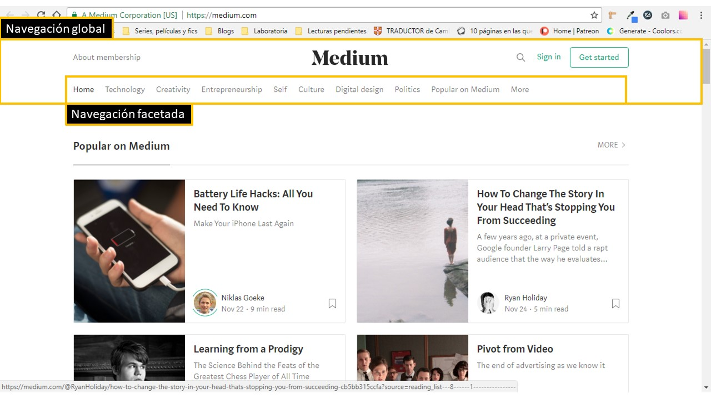

# Elementos de navegación

## Objetivo

Identificar los elementos de navegación en los siguientes sites:

* [Breather](https://breather.com/ "Breather")
* [Github](https://github.com/ "Github")
* [Medium](https://medium.com/ "Medium")

## Identificación

### Breather

La barra superior de Breather es de navegación gobal, se encuentra siempre y nos sirve para ir a diferentes opciones.

Lista desplegable en las que se puede elegir la ciudad en la que se busque el alojamiento.

Filtros específicos en los que el usuario puede elegir la ubicación de su alojamiento, las fechas, el número de asistentes, entre otras cosas.

Filtro para elegir de qué sede se quieren mostrar las fotos.

Filtros predefinidos de los países en los que Breather ofrece empleo.

El footer también presenta un tipo de navegación gobal, tiene la misma estructura de la barra principal y se muestra en todas las páginas.

### Github

Barra superior, aparece en todas las páginas. Contiene el logo de Github, utilidades para agregar repositorios nuevos y acceder al menú de usuario, y permite navegar por las demás opciones de la página.

Esta barra se encuentra solo en la sección principal de la página, contiene pestañas que cuentan con un indicador para saber cuál se encuentra en primer plano y permiten explorar opciones relevantes cuando recién se ingresa a la página.

Esta barra de navegación permite ingresar a las opciones propias de la sección "Pull requests".

Esta sección es una lista que permite filtrar aplicaciones por medio de categorías predefinidas.

Menú desplegable que permite indicar si se quiere filtrar los trending por períodos de tiempo de un día, una semana o un mes, mas son opciones limitadas y predefinidas.

El footer contiene también links que permiten navegar por la página, son opciones diferentes a las de la barra superior y no están enfocadas al trabajo del usuario, sino más bien a información de Github en sí. Aparece en todas las páginas.

### Medium

En el header se encuentran dos tipos de navegación: la global y la facetada. La global se evidencia en la persistencia y la importancia que tiene en la navegación de los usuarios. La navegación facetada, entra al tener categorías predefinidas que filtran los artículos por temas o etiquetas.

Al finalizar un artículo se encuentra debajo de este, una sección de sugerencias de otros artículos en base a un tema en común.

Dentro de los artículos, se encuentran links adicionales.

Categorías predefinidas de los artículos separados por temas.

Temas predefinidos por la página para separar las preguntas en la sección de ayuda.

División de equipos definidos por Medium en los que se encuentra un puesto de trabajo abierto.
